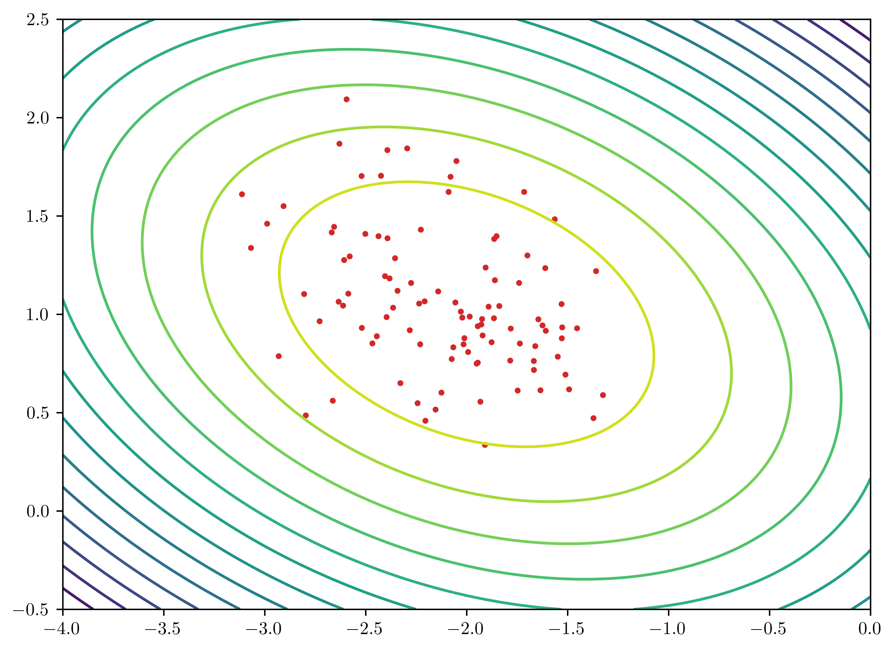
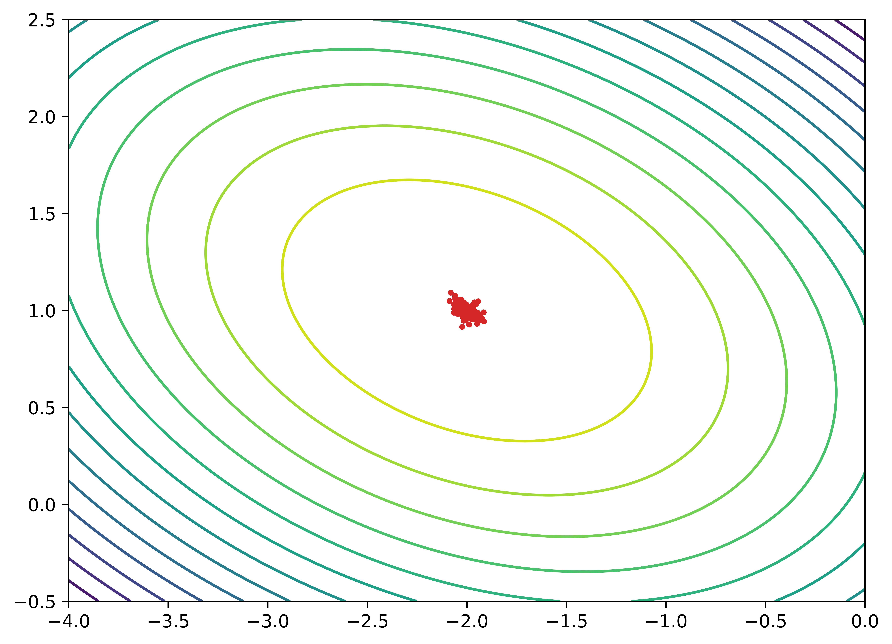
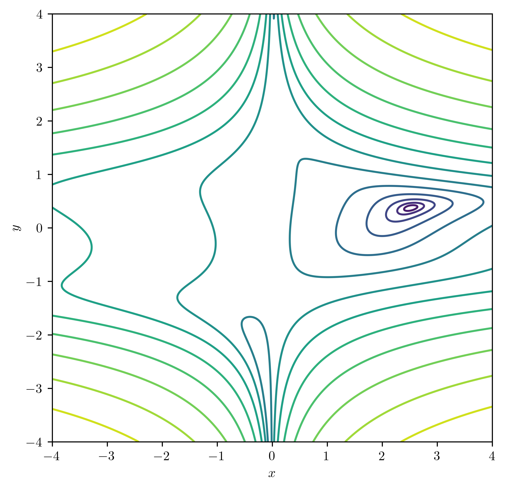
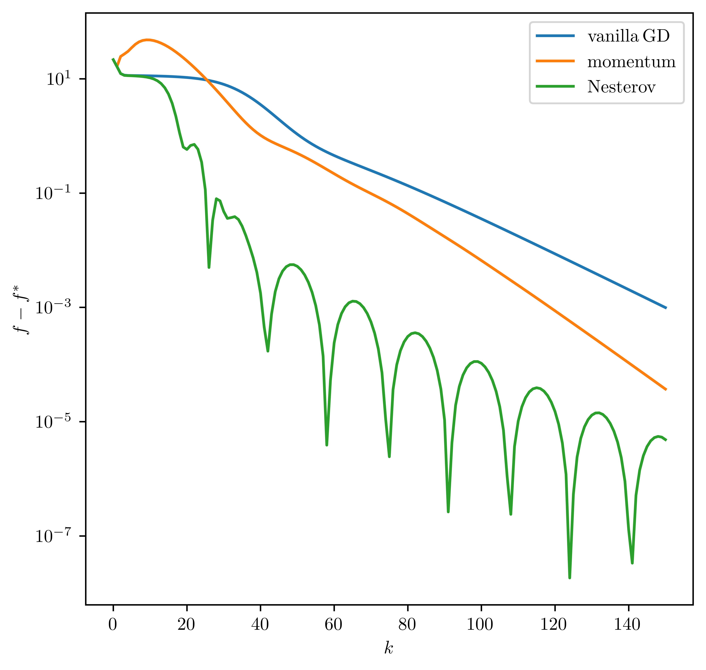
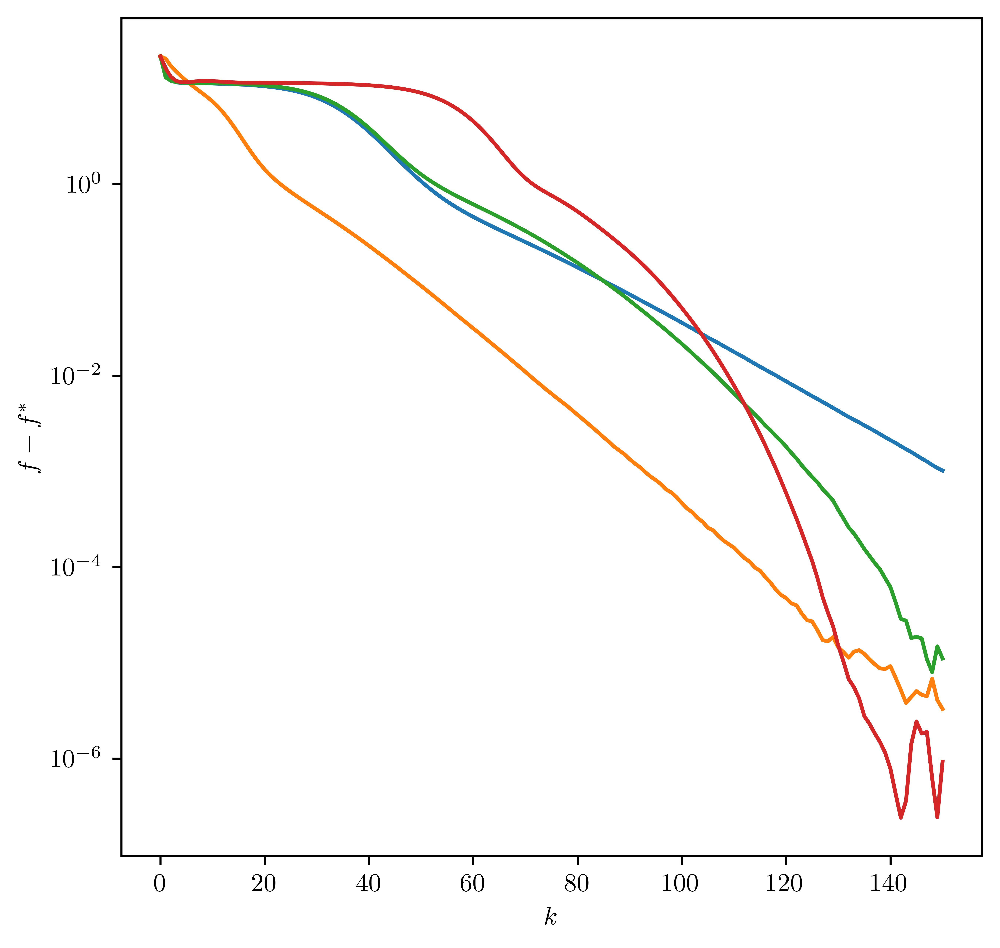

# <center>Statistical Models and Computing Methods, Problem Set 1
<center>王宇哲 2201112023
<center>Academy for Advanced Interdisciplinary Studies, Peking University

## Problem 1

(1) Show that $X\sim \mathcal{N}(0,1)$ is the maximum entropy distribution such that $\mathbb{E}X = 0$ and $\mathbb{E}X^2 = 1$.

***Proof.*** Consider continuous random variable $X\in\mathcal{R}^1$ with probability density $p(x)$, the entropy $H(p(x))$ is defined as
$$
H[p(x)]=-\int_{-\infty}^{\infty}p(x)\log p(x)dx\tag{1}
$$
which is a functional of $p(x)$. 

The entropy maximization problem is to minimize $-H[p(x)]$ subject to $\mathbb{E}X=0$, $\mathbb{E}X^2=1$ and probability density normalization, denoted as
$$
E[p(x)]=\int_{-\infty}^{\infty} xp(x)dx=0\tag{2}
$$
$$
D[p(x)]=\int_{-\infty}^{\infty} x^2 p(x)dx=1\tag{3}
$$
$$
N[p(x)]=\int_{-\infty}^{\infty} p(x)dx=1\tag{4}
$$
We introduce the Lagrangian
$$
L[p(x),\lambda,\mu, \nu]=-H[p(x)]+\lambda E[p(x)]+\mu( D[p(x)]-1)+\nu(N[p(x)]-1)\tag{5}
$$
as auxiliary functional and minimize $L[p(x)]$ by setting
$$
\frac{\delta L[p(x)]}{\delta p(x)}=-\frac{\delta H[p(x)]}{\delta p(x)}+\lambda \frac{\delta E[p(x)]}{\delta p(x)}+\mu \frac{\delta D[p(x)]}{\delta p(x)}+\nu \frac{\delta N[p(x)]}{\delta p(x)}=0\tag{6}
$$
which is
$$
\log p(x)+1+\lambda x + \mu x^2+\nu = 0\tag{7}
$$
by calculation.

Hence $p(x)$ has the form
$$
p(x)=\exp(-\mu x^2 -\lambda x-\nu-1)\tag{8}
$$
The dual function is
$$
g(\lambda, \mu, \nu)=-\int_{-\infty}^{\infty} \exp(-\mu x^2 -\lambda x -\nu-1) dx -\mu-\nu=-\sqrt{\frac{\pi}{\mu}}\exp(\frac{\lambda^2}{4\mu}-\nu-1)-\mu-\nu \tag{9}
$$
We maximize $g(\lambda, \mu, \nu)$ to find the dual optimal
$$
\lambda^{*}=0,\ \ \mu^{*} =\frac{1}{2}, \ \ \nu^* =\frac{1}{2} \log (2\pi) -1  \tag{10}
$$
Hence the maximum entropy distribution corresponds to
$$
p^{*}(x)=\frac{1}{\sqrt{2\pi}}\exp(-\frac{x^2}{2})\tag{11}
$$
which is the standard normal distribution.

(2) Generalize the result in (1) for the maximum entropy distribution given the first $k$ moments, *i.e.*, $\mathbb{E}X^i = m_i$; $i = 1, \ldots, k$. 

***Proof.*** Similar to $(5)$, we have the Lagrangian
$$
L[p(x),\{\lambda_i\}_{i=0}^{k}]=-H[p(x)]+\sum_{i=0}^{k} \lambda_{i}(E_{i}[p(x)]-m_i)\tag{12}
$$
where $E_{i}[p(x)]$ is defined as
$$
E_{i}[p(x)]=m_{i}=\left\{
\begin{array}{lr}
\int_{-\infty}^{\infty} p(x)dx=1  & i=0 \\
\int_{-\infty}^{\infty}x p(x)dx=m_1  & i=1 \\
\int_{-\infty}^{\infty}(x-m_1)^i p(x)dx & i\geq 2 
\end{array}
\right.\tag{13}
$$
Minimize $L[p(x)]$ to obtain
$$
\log p(x)+1+\sum_{i=2}^{k}\lambda_i (x-m_1)^i+\lambda_{1}x+\lambda_0 =0\tag{14}
$$
Hence
$$
p(x)=\exp(-\sum_{i=2}^{k}\lambda_i (x-m_1)^i -\lambda_{1}x-\lambda_0 -1)\tag{15}
$$
The dual function is
$$
g(\{\lambda_i\}_{i=0}^{k})=-\int_{-\infty}^{\infty} \exp(-\sum_{i=2}^{k}\lambda_i (x-m_1)^i-\lambda_{1}x-\lambda_0 -1) dx -\sum_{i=0}^{k}m_{i}\lambda_i \tag{16}
$$
Generally, we maximize $g(\{\lambda_i\}_{i=0}^{k})$ to find the dual optimal
$$
\{\lambda^{*}_i\}_{i=0}^{k}=\underset{\{\lambda_i\}_{i=0}^{k}}{\arg\max}\Big(-\int_{-\infty}^{\infty} \exp(-\sum_{i=2}^{k}\lambda_i (x-m_1)^i-\lambda_{1}x-\lambda_0-1) dx -\sum_{i=1}^{k}m_{i}\lambda_i\Big)\tag{17}
$$
and the maximum entropy distribution has the probability density function in the form of
$$
p^{*}(x)=\exp(-\sum_{i=2}^{k}\lambda^{*}_i (x-m_1)^i -\lambda^{*}_{1}x-\lambda^{*}_0 -1)\tag{18}
$$

## Problem 2

Let $Y_1,\cdots,Y_n$ be a set of independent random variables with the following pdfs
$$
p(y_i|\theta_i) = \exp(y_i b(\theta_i) + c(\theta_i) + d(y_i)); \  \ i = 1,\ldots, n\tag{19}
$$
Let $\mathbb{E}(Y_i) = \mu_i(\theta_i)$, $g(\mu_i) = x_i^T\beta$, where $g$ is the link function and $\beta \in \mathbb{R}^{d}$ is the vector of model parameters.

(1) Denote $g(\mu_i)$ as $\eta_i$, and let $s$ be the score function of $\beta$. Show that
$$
s_j = \sum_{i=1}^n \frac{(y_i - \mu_i)x_{ij}}{\mathbb{V}{\rm ar}(Y_i)}\frac{\partial \mu_i}{\partial \eta_i}, \ \ j=1, \ldots ,d\tag{20}
$$

***Proof.*** Denote 
$$
L(\theta_i)=y_i b(\theta_i) + c(\theta_i) + d(yi)\tag{21}
$$
By chain rule, we have
$$
\frac{\partial L}{\partial \beta_j}=\sum_{i=1}^{n}\frac{\partial L}{\partial\theta_i}\frac{\partial \theta_i}{\partial\mu_i}\frac{\partial \mu_i}{\partial\eta_i}\frac{\partial\eta_i}{\partial\beta_j}\tag{22}
$$
Consider that 
$$
\mathbb{E}\Big(\frac{\partial L}{\partial\theta_i}\Big)=\mathbb{E}\big(y_{i} b' (\theta_i)+c'(\theta_i)\big)=\mathbb{E}(y_{i}) b' (\theta_i)+c'(\theta_i)=\mu_i b' (\theta_i)+c'(\theta_i)=0\tag{23}
$$
hence
$$
\frac{\partial L}{\partial\theta_i}=(y_i -\mu_i)b'(\theta_i)\tag{24}
$$
Consider that $\eta_i=g(\mu_i)=x_i^T\beta$, we have
$$
\frac{\partial \eta_i}{\partial \beta_j}=x_{ij}\tag{25}
$$
Consider that
$$
\mathbb{E}(Y_i)=\mu_i (\theta_i)=\int_{-\infty}^{\infty}y_i \exp(y_i b(\theta_i)+c(\theta_i )+d(y_i))\tag{26}
$$
we have
$$
\frac{\partial \mu_i}{\partial \theta_i}=\int_{-\infty}^{\infty}(y^2_i b'(\theta_i)+y_i c'(\theta_i)) \exp(y_i b(\theta_i)+c(\theta_i )+d(y_i))\tag{27}
$$
From $(23)$ we have
$$
c'(\theta_i)=-\mu_i b' (\theta_i)\tag{28}
$$
Substitute $(28)$ to $(27)$ to obtain
$$
\frac{\partial \mu_i}{\partial \theta_i}=b'(\theta_i)\int_{-\infty}^{\infty}(y^2_i -y_i \mu_i) \exp(y_i b(\theta_i)+c(\theta_i )+d(y_i))=b'(\theta_i)\mathbb{V}{\rm ar}(Y_i)\tag{29}
$$
Combine $(22)$, $(24)$, $(25)$, $(29)$ to obtain $(20)$.

(2) Let $\mathcal{I}$ be the Fisher information matrix. Show that
$$
\mathcal{I}_{jk}=\mathbb{E}(s_j, s_k)=\sum_{i=1}^n \frac{x_{ij}x_{ik}}{\mathbb{V}ar(Y_i)}\Big(\frac{\partial \mu_i}{\partial \eta_i}\Big)^2, \forall 1\leq j,k\leq d\tag{30}
$$

***Proof.*** From $(20)$ we have
$$
\mathcal{I}_{jk}=\mathbb{E}(s_j, s_k)=\sum_{i=1}^{n}\sum_{l=1}^{n}\frac{\mathbb{E}\big((y_i-\mu_i)(y_l-\mu_l)\big)x_{ij}x_{lk}}{\mathbb{V}{\rm ar}(Y_i)\mathbb{V}{\rm ar}(Y_l)}\Big(\frac{\partial\mu_i}{\partial \eta_i}\Big)\Big(\frac{\partial \mu_l}{\partial\eta_l}\Big)\tag{31}
$$
consider that $\{Y_i\}_{i=1}^{n}$ are independent random variables, it's easy to show that
$$
\mathbb{E}\big((y_i-\mu_i)(y_l-\mu_l)\big)=\left\{
\begin{array}{lr}
\mathbb{V}{\rm ar}(Y_i)  & i=j \\
0 & i\neq j 
\end{array}
\right.\tag{32}
$$
Therefore
$$
\mathcal{I}_{jk}=\sum_{i=1}^n \frac{x_{ij}x_{ik}}{\mathbb{V}ar(Y_i)}\Big(\frac{\partial \mu_i}{\partial \eta_i}\Big)^2\tag{33}
$$
which is $(30)$.

## Problem 3

Use the following code to generate covariate matrices $X$


```python
import numpy as np
np.random.seed(1234)

n = 100
X = np.random.normal(size=(n,2))
```

(1) Generate $n = 100$ observations $Y$ following the logistic regression model with true parameter $\beta_0 = (-2, 1)$.

***Proof.*** For logistic regression model, we have
$$
p=\frac{1}{1+\exp{(-X\beta)}}\tag{34}
$$
substitute $\beta_0 =(-2, 1)$ into $(34)$ and generate $n=100$ observations $Y$ using the following code. 


```python
import numpy as np

np.random.seed(1234)

n = 100
X = np.random.normal(size=(n,2))

beta_0 = np.array([-2, 1]).reshape(2,1)
theta_0 = np.dot(X, beta_0)
p_0 = 1 / (1 + np.exp(-theta_0))

Y = np.array([1 if np.random.geometric(p_0[i]) == 1 else 0 for i in range(len(p_0))]).reshape(n,1)
```

(2) Find the MLE using the iteratively reweighted least square algorithm. 

***Proof.*** Consider Newton's update (see detailed derivation in lecture slides)
$$
\beta_{(k+1)}=\beta_{(k)}+\big(X^T W^{(k)}X\big)^{-1}\big(X^{T}(Y-p^{(k)})\big)\tag{35}
$$
where
$$
w_{ii}=p_i (1-p_i)\tag{36}
$$
We set $\beta^{(1)}=(0, 0)$ and $p^{(0)}_i =0.5, \ \ \forall i$ as initial conditions and
$$
||\beta^{(k+1)}-\beta^{k}||\leq \epsilon = 10^{-4}\tag{37}
$$
as stopping threshold. Detailed implementation is as follows.


```python
import numpy as np

np.random.seed(1234)

n = 100
X = np.random.normal(size=(n,2))

beta_0 = np.array([-2, 1]).reshape(2,1)
theta_0 = np.dot(X, beta_0)
p_0 = 1 / (1 + np.exp(-theta_0))

Y = np.array([1 if np.random.geometric(p_0[i]) == 1 else 0 for i in range(len(p_0))]).reshape(n,1)

epsilon = 1e-4
beta = np.zeros(2).reshape(2,1)
p = np.ones(100).reshape(n,1) / 2
delta_beta= epsilon * 2

W = np.diag(np.array([p[i][0] * (1-p[i][0]) for i in range(len(p))]))


while delta_beta > epsilon:
    W = np.diag(np.array([p[i][0] * (1-p[i][0]) for i in range(len(p))]))
    beta_init = beta.copy()
    beta += np.dot(np.linalg.inv(np.dot(np.dot(X.T, W), X)), np.dot(X.T, (Y-p)))
    delta_beta = np.linalg.norm(beta - beta_init)
    p = 1 / (1 + np.exp(-np.dot(X, beta)))

print(beta)
```

    [[-1.76618431]
     [ 0.48272407]]


Therefore, the MLE of $\beta$ is calculated to be $\beta=(-1.7662, 0.4827)$ using the iteratively reweighted least square algorithm. 

(3) Repeat (1) and (2) for 100 instances. Compare the MLEs with the asymptotical
distribution $\beta\sim\mathcal{N}(\beta_0, \mathcal{I}^{-1}(\beta_0))$. Present your result with a scatter plot for MLEs with contours for the pdf of the asymptotical distribution.

***Proof.*** We can calculate
$$
\mathcal{I}^{-1}(\beta_0)=(X^T W X)^{-1}=\begin{bmatrix}0.05175 & 0.00794 \\ 0.00794 & 0.03592\end{bmatrix}\tag{38}
$$
Consider that the asymptotical distribution
$$
\beta\sim \mathcal{N}(\beta_{0}, \mathcal{I}^{-1}(\beta_0))\tag{39}
$$
we have the pdf
$$
p(\beta)=\frac{1}{2\pi\sqrt{|\mathcal{I}^{-1}(\beta_0)|}}\exp\big(-\frac{1}{2}(\beta-\beta_0)^T \mathcal{I}(\beta_0)(\beta-\beta_0)\big)\tag{40}
$$
Detailed implementation is as follows.


```python
import numpy as np
import matplotlib.pyplot as plt
%matplotlib inline

np.random.seed(1234)

n = 100
epsilon = 1e-4
X = np.random.normal(size=(n,2))

beta_0 = np.array([-2, 1]).reshape(2,1)
theta_0 = np.dot(X, beta_0)
p_0 = 1 / (1 + np.exp(-theta_0))

W_0 = np.diag(np.array([p_0[i][0] * (1-p_0[i][0]) for i in range(len(p_0))]))
I = np.dot(np.dot(X.T, W_0), X)

beta_i, beta_j = np.meshgrid(np.linspace(-4, 0, 1000), np.linspace(-0.5, 2.5, 1000))
f = (2 * np.pi * np.sqrt(np.linalg.norm(np.linalg.inv(I)))) ** (-1) * np.exp(-0.5 * ((beta_i+2) ** 2 * I[0,0] + 2 * (beta_i+2) * (beta_j-1) * I[0,1] + (beta_j-1) ** 2 * I[1,1]))

f_log = np.log10(f)
levels = np.linspace(f_log.min(), f_log.max(), 15)

fig, ax = plt.subplots()

ax.contour(beta_i, beta_j, f_log, levels=levels)

for iter in range(100):
    np.random.seed()
    Y = np.array([1 if np.random.geometric(p_0[i]) == 1 else 0 for i in range(len(p_0))]).reshape(n,1)

    beta = np.zeros(2).reshape(2,1)
    p = np.ones(n).reshape(n,1) / 2
    delta_beta= epsilon * 2

    W = np.diag(np.array([p[i][0] * (1-p[i][0]) for i in range(len(p))]))

    while delta_beta > epsilon:
        W = np.diag(np.array([p[i][0] * (1-p[i][0]) for i in range(len(p))]))
        beta_init = beta.copy()
        beta += np.dot(np.linalg.inv(np.dot(np.dot(X.T, W), X)), np.dot(X.T, (Y-p)))
        delta_beta = np.linalg.norm(beta - beta_init)
        p = 1 / (1 + np.exp(-np.dot(X, beta)))

    ax.scatter(beta[0][0], beta[1][0], c='tab:red', s=5)


plt.rcParams.update({
    "text.usetex": True
})
fig.set_size_inches(8,6)
plt.savefig('3-3.jpg',dpi=1000, bbox_inches='tight')
plt.xlabel('$\\beta_i$')
plt.ylabel('$\\beta_j$')
plt.show()
```



    


(4) Try the same for $n = 10000$. Does the asymptotical distribution provide a better fit to the MLEs? You can use the empirical covariance matrix of the MLEs for comparison.

***Proof.*** Detailed implementation is as follows. Contours in $3-(3)$ are used for comparison. Empirical covariance matrix are computed respectively.


```python
import numpy as np
import matplotlib.pyplot as plt
from sklearn.covariance import empirical_covariance
%matplotlib inline

fig, ax = plt.subplots()

# n=100
np.random.seed(1234)

n = 100
epsilon = 1e-4
X = np.random.normal(size=(n,2))
result_mat_100 = np.zeros((n,2))

beta_0 = np.array([-2, 1]).reshape(2,1)
theta_0 = np.dot(X, beta_0)
p_0 = 1 / (1 + np.exp(-theta_0))

W_0 = np.diag(np.array([p_0[i][0] * (1-p_0[i][0]) for i in range(len(p_0))]))
I = np.dot(np.dot(X.T, W_0), X)

beta_i, beta_j = np.meshgrid(np.linspace(-4, 0, 1000), np.linspace(-0.5, 2.5, 1000))
f = (2 * np.pi * np.sqrt(np.linalg.norm(np.linalg.inv(I)))) ** (-1) * np.exp(-0.5 * ((beta_i+2) ** 2 * I[0,0] + 2 * (beta_i+2) * (beta_j-1) * I[0,1] + (beta_j-1) ** 2 * I[1,1]))

f_log = np.log10(f)
levels = np.linspace(f_log.min(), f_log.max(), 15)

ax.contour(beta_i, beta_j, f_log, levels=levels)

for iter in range(100):
    np.random.seed()
    Y = np.array([1 if np.random.geometric(p_0[i]) == 1 else 0 for i in range(len(p_0))]).reshape(n,1)

    beta = np.zeros(2).reshape(2,1)
    p = np.ones(n).reshape(n,1) / 2
    delta_beta= epsilon * 2

    W = np.diag(np.array([p[i][0] * (1-p[i][0]) for i in range(len(p))]))

    while delta_beta > epsilon:
        W = np.diag(np.array([p[i][0] * (1-p[i][0]) for i in range(len(p))]))
        beta_init = beta.copy()
        beta += np.dot(np.linalg.inv(np.dot(np.dot(X.T, W), X)), np.dot(X.T, (Y-p)))
        delta_beta = np.linalg.norm(beta - beta_init)
        p = 1 / (1 + np.exp(-np.dot(X, beta)))

    result_mat_100[iter] = beta.T


Cov_mat_100 = empirical_covariance(result_mat_100)
print(Cov_mat_100)
print(np.linalg.norm(Cov_mat_100))


# n=10000
np.random.seed(1234)

n = 10000
epsilon = 1e-4
X = np.random.normal(size=(n,2))
result_mat_10000 = np.zeros((n,2))

beta_0 = np.array([-2, 1]).reshape(2,1)
theta_0 = np.dot(X, beta_0)
p_0 = 1 / (1 + np.exp(-theta_0))

for iter in range(100):
    np.random.seed()
    Y = np.array([1 if np.random.geometric(p_0[i]) == 1 else 0 for i in range(len(p_0))]).reshape(n,1)

    beta = np.zeros(2).reshape(2,1)
    p = np.ones(n).reshape(n,1) / 2
    delta_beta= epsilon * 2

    W = np.diag(np.array([p[i][0] * (1-p[i][0]) for i in range(len(p))]))

    while delta_beta > epsilon:
        W = np.diag(np.array([p[i][0] * (1-p[i][0]) for i in range(len(p))]))
        beta_init = beta.copy()
        beta += np.dot(np.linalg.inv(np.dot(np.dot(X.T, W), X)), np.dot(X.T, (Y-p)))
        delta_beta = np.linalg.norm(beta - beta_init)
        p = 1 / (1 + np.exp(-np.dot(X, beta)))

    result_mat_10000[iter] = beta.T
    ax.scatter(beta[0][0], beta[1][0], c='tab:red', s=5)


Cov_mat_10000 = empirical_covariance(result_mat_10000)
print(Cov_mat_10000)
print(np.linalg.norm(Cov_mat_10000))


# plot settings
plt.rcParams.update({
    "text.usetex": True
})
fig.set_size_inches(8,6)
plt.savefig('3-4.jpg',dpi=1000, bbox_inches='tight')
plt.xlabel('$\\beta_i$')
plt.ylabel('$\\beta_j$')
plt.show()
```

    [[ 0.17481389 -0.02001855]
     [-0.02001855  0.10415242]]
    0.2054485463284348
    [[ 0.03967677 -0.01980663]
     [-0.01980663  0.00989584]]
    0.04956589949595511



    


We can see from the plot that for $𝑛=10000$, the asymptotical distribution **DO** provides a significantly better fit to the MLEs. Calculation result of empirical covariance matrix of the MLEs also confirms the conclusion above ($\det{(\rm Cov\_mat)}=0.20545 $ for $n=100$ and $\det{(\rm Cov\_mat)}= 0.04957$ for $n=10000$).

## Problem 4

Consider minimizing the following Beale's function
$$
f(x,y)=(1.5-x+xy)^2+(2.25-x+xy^2)^2+(2.625-x-xy^3)^2\tag{41}
$$
with an initial position at $(x_0,y_0) = (0.5,2)$.

(1) Find the global minima and show the contour plot over $[-4, 4]\times [4,4]$. 

***Proof.*** As a ground-truth reference, we analytically solute the minimization problem by setting
$$
\left\{
\begin{array}{l}
\frac{\partial f(x,y)}{\partial x}=2(-1+y)(1.5-x+xy)+2(-1+y^2)(2.25-x+xy^2)+2(-1-y^3)(2.625-x-xy^3)=0\\
\frac{\partial f(x,y)}{\partial y}=2x(1.5-x+xy)+4xy(2.25-x+xy^2)-6xy^2(2.625-x-xy^3)=0 \\
\frac{\partial^2 f(x,y)}{\partial x^2}>0 \\
\frac{\partial^2 f(x,y)}{\partial y^2}>0 
\end{array}
\right.\tag{42}
$$
Solve $(42)$ (using Mathematica) to obtain the global minima
$$
\underset{x,y}{\arg\min f(x,y)}=(2.51799, 0.37463)\tag{43}
$$
and $f_{\min}(x,y)=0.0135145$.

Generate the contour plot using the following code. Coutours are not distributed equally for higher visualization quality.


```python
import numpy as np
import matplotlib.pyplot as plt
%matplotlib inline

X, Y = np.meshgrid(np.linspace(-4, 4, 1000), np.linspace(-4, 4, 1000))
f = (1.5 - X + X * Y) ** 2 + (2.25 - X + X * Y ** 2) ** 2 + (2.625 - X - X * Y ** 3) ** 2

f_log = np.log10(f)
levels = np.linspace(f_log.min(), f_log.max(), 15)

fig, ax = plt.subplots()

ax.contour(X, Y, f_log, levels=levels)

plt.rcParams.update({
    "text.usetex": True
})
plt.xlabel('$x$')
plt.ylabel('$y$')
fig.set_size_inches(6,6)
plt.savefig('4-1.jpg',dpi=1000, bbox_inches='tight')
plt.show()
```



​    


(2) Compare gradient descent, gradient descent with momentum and nesterov's accelerated gradient descent. Plot $f-f^*$ as a function of the number of iterations.

***Proof.*** We use the following code to implement gradient descent, gradient descent with momentum and nesterov's accelerated gradient descent, respectively.


```python
import numpy as np
import matplotlib.pyplot as plt
%matplotlib inline

def f(x:float, y:float):
    """
    Beale's function
    """
    return (1.5 - x + x * y) ** 2 + (2.25 - x + x * y ** 2) ** 2 + (2.625 - x - x * y ** 3) ** 2


def nabla_f(x:float, y:float):
    """
    gradient of f, returns a 2D array
    """
    fx = 2 * (-1 + y) * (1.5 - x + x * y) + 2 * (-1 + y ** 2) * (2.25 - x + x * y ** 2) + 2 * (-1 - y ** 3) * (2.625 - x - x * y ** 3)
    fy = 2 * x * (1.5 - x + x * y) + 4 * x * y * (2.25 - x + x * y ** 2) - 6 * x * y ** 2 * (2.625 - x - x * y ** 3)

    return np.array([fx, fy])


def noise_nabla_f(x:float, y:float, sigma=0.01):
    """
    stochastic gradient of f, returns a 2D array
    """
    fx = 2 * (-1 + y) * (1.5 - x + x * y) + 2 * (-1 + y ** 2) * (2.25 - x + x * y ** 2) + 2 * (-1 - y ** 3) * (2.625 - x - x * y ** 3)
    fy = 2 * x * (1.5 - x + x * y) + 4 * x * y * (2.25 - x + x * y ** 2) - 6 * x * y ** 2 * (2.625 - x - x * y ** 3)

    return np.random.normal(loc=np.array([fx, fy]), scale=sigma)


# gradient decent
def GD_vanilla(x0:float, y0:float, fmin=0.0135145, lr=0.01, iter=150):
    """
    implementation of vanilla gradient decent
    """
    z = np.array([x0, y0])
    coord_list = [(0, z.copy())]
    result_list = [f(x0, y0)-fmin]

    for i in range(iter):
        z += -lr * nabla_f(z[0], z[1])
        coord_list.append((i+1, z.copy()))
        result_list.append(f(z[0], z[1])-fmin)
    
    return result_list      


# gradient decent with momentum
def GD_momentum(x0:float, y0:float, fmin=0.0135145, mu=0.85, lr=0.01, iter=150):
    """
    implementation of gradient decent with momentum
    """
    z = np.array([x0, y0])
    m = nabla_f(x0, y0)
    coord_list = [(0, z.copy())]
    result_list = [f(x0, y0)-fmin]

    for i in range(iter):
        z += -lr * m
        m = mu * m + (1-mu) * nabla_f(z[0], z[1])
        coord_list.append((i+1, z.copy()))
        result_list.append(f(z[0], z[1])-fmin)
        
    return result_list


# Nesterov's accelerated gradient decent
def GD_nesterov(x0:float, y0:float, fmin=0.0135145, lr=0.01, iter=150):
    """
    implementation of Nesterov's accelerated gradient decent
    """
    z = np.array([x0, y0])
    coord_list = [(0, z.copy())]
    result_list = [f(x0, y0)-fmin]

    for i in range(iter):
        if i == 0:
            z += -lr * nabla_f(z[0], z[1])
            coord_list.append((i+1, z.copy()))
            result_list.append(f(z[0], z[1])-fmin)
        else:
            y = coord_list[i][1] + (coord_list[i][1] - coord_list[i-1][1]) * (i - 1) / (i + 2)
            z = y - lr * nabla_f(y[0], y[1])
            coord_list.append((i+1, z.copy()))
            result_list.append(f(z[0], z[1])-fmin)

    return result_list


k = np.linspace(0, 150, 151)
fig, ax = plt.subplots()

ax.plot(k, np.array(GD_vanilla(0.5, 2)))
ax.plot(k, np.array(GD_momentum(0.5, 2)))
ax.plot(k, np.array(GD_nesterov(0.5, 2)))

plt.yscale('log')
plt.rcParams.update({
    "text.usetex": True
})
plt.xlabel('$k$')
plt.ylabel('$f-f^*$')
plt.legend(['$\\rm vanilla \\, GD$', '\\rm momentum', '\\rm Nesterov'])
fig.set_size_inches(6,6)
plt.savefig('4-2.jpg',dpi=1000, bbox_inches='tight')
plt.show()
```



​    


We can see that with same learning rate, gradient decent with momentum has faster rate of convergence than vanilla gradient decent, while Nesterov's accelerated gradient decent, with unique numerical fluctuation patterns, converges even faster than gradient decent with momentum.

(3) Compare vanilla stochastic gradient descent with different adaptive stochastic gradient descent methods, including AdaGrad, RMSprop, and Adam. Plot $f-f^*$ as a function of the number of iterations. You can add some random noise (e.g., $\mathcal{N}(0, 0.01))$ to the exact gradient to form the stochastic gradient.

***Proof.*** We use the following code to implement vanilla stochastic gradient descent, AdaGrad, RMSprop and Adam, respectively. Hyper parameters are **carefully tuned** for better performance.


```python
import numpy as np
import matplotlib.pyplot as plt
%matplotlib inline

def f(x:float, y:float):
    """
    Beale's function
    """
    return (1.5 - x + x * y) ** 2 + (2.25 - x + x * y ** 2) ** 2 + (2.625 - x - x * y ** 3) ** 2


def nabla_f(x:float, y:float):
    """
    gradient of f, returns a 2D array
    """
    fx = 2 * (-1 + y) * (1.5 - x + x * y) + 2 * (-1 + y ** 2) * (2.25 - x + x * y ** 2) + 2 * (-1 - y ** 3) * (2.625 - x - x * y ** 3)
    fy = 2 * x * (1.5 - x + x * y) + 4 * x * y * (2.25 - x + x * y ** 2) - 6 * x * y ** 2 * (2.625 - x - x * y ** 3)

    return np.array([fx, fy])


def noise_nabla_f(x:float, y:float, sigma=0.01):
    """
    stochastic gradient of f, returns a 2D array
    """
    fx = 2 * (-1 + y) * (1.5 - x + x * y) + 2 * (-1 + y ** 2) * (2.25 - x + x * y ** 2) + 2 * (-1 - y ** 3) * (2.625 - x - x * y ** 3)
    fy = 2 * x * (1.5 - x + x * y) + 4 * x * y * (2.25 - x + x * y ** 2) - 6 * x * y ** 2 * (2.625 - x - x * y ** 3)

    return np.random.normal(loc=np.array([fx, fy]), scale=sigma)


# stochastic gradient decent
def SGD_vanilla(x0:float, y0:float, fmin=0.0135145, lr=0.01, iter=150):
    """
    implementation of vanilla stochastic gradient decent
    """
    z = np.array([x0, y0])
    coord_list = [(0, z.copy())]
    result_list = [f(x0, y0)-fmin]

    for i in range(iter):
        z += -lr * noise_nabla_f(z[0], z[1])
        coord_list.append((i+1, z.copy()))
        result_list.append(f(z[0], z[1])-fmin)
    
    return result_list


# AdaGrad
def SGD_AdaGrad(x0:float, y0:float, fmin=0.0135145, epsilon=1e-8, lr=1, iter=150):
    """
    implementation of AdaGrad
    """
    z = np.array([x0, y0])
    coord_list = [(0, z.copy())]
    gx2_sum, gy2_sum = 0, 0 # g refers to gradient
    result_list = [f(x0, y0)-fmin]

    for i in range(iter):
        (gx, gy) = noise_nabla_f(z[0], z[1])
        gx2_sum += gx ** 2
        gy2_sum += gy ** 2
        z += -lr * np.array([gx / np.sqrt(gx2_sum + epsilon), gy / np.sqrt(gy2_sum + epsilon)])
        coord_list.append((i+1, z.copy()))
        result_list.append(f(z[0], z[1])-fmin)
        
    return result_list

# RMSprop
def SGD_RMSprop(x0:float, y0:float, fmin=0.0135145, epsilon=1e-8, beta=0.98, lr=0.06, iter=150):
    """
    implementation of RMSprop
    """
    z = np.array([x0, y0])
    gx2_sum = gy2_sum = 0
    coord_list = [(0, z.copy())]
    result_list = [f(x0, y0)-fmin]

    for i in range(iter):
        (gx, gy) = noise_nabla_f(z[0], z[1])
        gx2_sum = beta * gx2_sum + (1-beta) * gx ** 2
        gy2_sum = beta * gy2_sum + (1-beta) * gy ** 2
        z += -lr * np.array([gx / np.sqrt(gx2_sum + epsilon), gy / np.sqrt(gy2_sum + epsilon)])
        coord_list.append((i+1, z.copy()))
        result_list.append(f(z[0], z[1])-fmin)

    return result_list


# Adam
def SGD_Adam(x0:float, y0:float, fmin=0.0135145, epsilon=1e-8, beta_1=0.75, beta_2=0.97, lr=0.07, iter=150):
    """
    implementation of Adam
    """
    z = np.array([x0, y0])
    mx = my = vx = vy = 0
    coord_list = [(0, z.copy())]
    result_list = [f(x0, y0)-fmin]

    for i in range(iter):
        (gx, gy) = noise_nabla_f(z[0], z[1])
        mx = beta_1 * mx + (1-beta_1) * gx 
        my = beta_1 * my + (1-beta_1) * gy
        vx = beta_2 * vx + (1-beta_2) * gx ** 2
        vy = beta_2 * vy + (1-beta_2) * gy ** 2

        mx_hat = mx / (1 - beta_1 ** (i+1))
        my_hat = my / (1 - beta_1 ** (i+1))
        vx_hat = vx / (1 - beta_2 ** (i+1))
        vy_hat = vy / (1 - beta_2 ** (i+1))

        z += -lr * np.array([mx_hat / np.sqrt(vx_hat + epsilon), my_hat / np.sqrt(vy_hat + epsilon)])
        coord_list.append((i+1, z.copy()))
        result_list.append(f(z[0], z[1])-fmin)

    return result_list


k = np.linspace(0, 150, 151)
fig, ax = plt.subplots()

ax.plot(k, np.array(SGD_vanilla(0.5, 2)))
ax.plot(k, np.array(SGD_AdaGrad(0.5, 2)))
ax.plot(k, np.array(SGD_RMSprop(0.5, 2)))
ax.plot(k, np.array(SGD_Adam(0.5, 2)))

plt.yscale('log')
plt.rcParams.update({
    "text.usetex": True
})
plt.xlabel('$k$')
plt.ylabel('$f-f^*$')
fig.set_size_inches(6,6)
plt.savefig('4-3.jpg',dpi=1000, bbox_inches='tight')
plt.legend(['$\\rm vanilla \\, SGD$', '\\rm AdaGrad', '\\rm RMSprop', '\\rm Adam'])
plt.show()
```



​    


We can see that with hyper parameters carefully tuned, three adaptive methods, namely AdaGrad, RMSprop and Adam all accelerate the stochastic gradient decent process. AdaGrad performs significantly well on this specific problem with robustness to hyper parameters' change, while Adam has achieved the best result after fine-tuning of hyperparameters. Numerical fluctuation is observed, however, when Adam is uttered, implying further optimization for this method on this specific problem.
