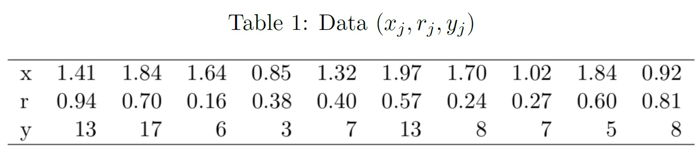

# 
Statistical Models and Computing Methods, Problem Set 3

王宇哲 2201112023

Academy for Advanced Interdisciplinary Studies, Peking University

## Problem 1

A total of $n$ instruments are used to observe the same astronomical source. Suppose the number of photons recorded by instrument $j$ can be modeled as $y_j \sim {\rm Poisson}(x_j\theta + r_j)$ where $\theta\geq 0$ is the parameter of interest, and $x_j$ and $r_j$ are known positive constants. You may think of $\theta, x_j , r_j$ as the source intensity, the observation time, and the background intensity for instrument $j$, respectively. Assume the photon counts across different instruments are independent.

(1) Write down the likelihood function for $\theta$.

***Proof.*** Consider that
$$
p(y_i=k|\theta)=\frac{(x_j\theta + r_j)^k e^{-(x_j\theta + r_j)}}{k!}\tag{1}
$$
hence the likelihood function for $\theta$ is
$$
\mathcal{L}(\theta)=\prod_{j=1}^{n}p(y_j|\theta)=\prod_{j=1}^{n}\frac{(x_j\theta+r_j)^{y_j}e^{-(x_j\theta+r_j)}}{y_j!}\tag{2}
$$
in which $\boldsymbol{y}=(y_1,\ldots,y_n)^{T}$.

The log-likelihood function for $\theta$ is 
$$
\mathcal{l}(\theta)=\log p(\boldsymbol{y}|\theta)=\sum_{j=1}^{n}\log p(y_j|\theta)=\sum_{j=1}^{n}\Big(y_j\log(x_j\theta+r_j)-(x_j\theta+r_j)-\log y_j!\Big)\tag{3}
$$
(2) Introduce mutually independent latent variables $z_{j1}\sim {\rm Poisson}(x_j\theta)$ and $z_{j2}\sim{\rm Poisson}(r_j)$ and suppose we observe only $y_j \equiv z_{j1} + z_{j2}$. Under this formulation, derive an EM algorithm to find the MLE of $\theta$.

***Proof.*** Consider that
$$
p(y_j,\boldsymbol{z}_j|\theta)=p(y_j|z_{j1},z_{j2},\theta)p(z_{j1}|\theta)p(z_{j2}|\theta)=\frac{(x_j\theta)^{z_{j1}}r_j^{z_{j2}}e^{-(x_j\theta+r_j)}}{z_{j1}!z_{j2}!}\tag{4}
$$
in which $\boldsymbol{z}_j=(z_{j1},z_{j2})^{T}$. We have the complete-data log-likelihood
$$
\mathcal{l}(\boldsymbol{y},\boldsymbol{z}|\theta)=\sum_{j=1}^{n}\log p(y_j,\boldsymbol{z}_j|\theta)=\sum_{j=1}^{n}\Big(z_{j1}\log(x_j\theta)+z_{j2}\log r_j-x_j\theta-r_j-\log (z_{j1}!z_{j2}!)\Big)\tag{5}
$$
in which $\boldsymbol{z}=(\boldsymbol{z}_1,\ldots,\boldsymbol{z}_n)^{T}$. The expected complete-data log-likelihood at timestep $t$ is
$$
Q^{(t)}(\theta)=\mathbb{E}_{p(\boldsymbol{z}|\boldsymbol{y},\theta^{(t)})}\mathcal{l}(\boldsymbol{y},\boldsymbol{z}|\theta)=\sum_{j=1}^{n}\mathbb{E}_{p(\boldsymbol{z}_j|y_j,\theta^{(t)})}\mathcal{l}(y_j,\boldsymbol{z}_j|\theta)\tag{6}
$$

compute the derivative w.r.t. $\theta$ 
$$
\frac{\partial}{\partial\theta}Q^{(t)}(\theta)=\sum_{j=1}^{n}\mathbb{E}_{p(\boldsymbol{z}_j|y_j,\theta^{(t)})}\Big(\frac{z_{j1}}{\theta}-x_j\Big)=\frac{1}{\theta}\sum_{j=1}^{n}\mathbb{E}_{p(z_{j1}|y_j,\theta^{(t)})}z_{j1}-\sum_{j=1}^{n}x_j\tag{7}
$$
and set the derivative to $0$ to obtain
$$
\theta^{(t+1)}=\mathop{\arg\max}_{\theta}\,Q^{(t)}(\theta)=\frac{\sum_{j=1}^{n}\mathbb{E}_{p(z_{j1}|y_j,\theta^{(t)})}z_{j1}}{\sum_{j=1}^{n}x_j}\tag{8}
$$
Consider that $y_j=z_{j1}+z_{j2}$, $z_{j1}\sim{\rm Poisson}(x_j\theta^{(t)})$, $z_{j2}\sim{\rm Poisson}(r_j)$, we can prove that
$$
z_{j1}|y_j=z_{j1}|(z_{j1}+z_{j2})\sim{\rm Binomial}(y_j,\frac{x_j\theta^{(t)}}{x_j\theta^{(t)}+r_j})\tag{9}
$$
*Proof Sketch.* Consider independent random variables $X_1\sim{\rm Poisson}(\lambda_1)$, $X_2\sim{\rm Poisson}(\lambda_2)$, then $X_1+X_2\sim{\rm Poisson}(\lambda_1+\lambda_2)$. Consider that
$$
\begin{aligned}
p(X_1=x|X_1+X_2=y)&=\frac{p(X_1=x,X_1+X_2=y)}{p(X_1+X_2=y)}\\
&=\frac{p(X_1=x)p(X_2=y-x)}{p(X_1+X_2=y)}\\
&={\frac{\lambda_1^{x}e^{-\lambda_1}}{x!}\frac{\lambda_2^{y-x}e^{-\lambda_2}}{(y-x)!}}{\frac{y!}{(\lambda_1+\lambda_2)^{y}e^{-\lambda_1-\lambda_2}}}\\
&=\frac{y!}{x!(y-x)!}\Big(\frac{\lambda_1}{\lambda_1+\lambda_2}\Big)^x\Big(1-\frac{\lambda_1}{\lambda_1+\lambda_2}\Big)^{y-x}
\end{aligned}\tag{10}
$$
we have $X_1|X_1+X_2\sim{\rm Binomial}(X_1+X_2,\frac{\lambda_1}{\lambda_1+\lambda_2})$. 	$\square$

We compute the expectation of Binomial distribution
$$
\mathbb{E}_{p(z_{j1}|y_j,\theta^{(t)})}z_{j1}=\frac{x_jy_j\theta^{(t)}}{x_j\theta^{(t)}+r_j}\tag{11}
$$
hence
$$
\theta^{(t+1)}=\frac{\theta^{(t)}}{\sum_{j=1}^{n}x_j}\sum_{j=1}^{n}\frac{x_jy_j}{x_j\theta^{(t)}+r_j}\tag{12}
$$
The EM algorithm to find the MLE of $\theta$ is presented below.

1. randomly initialize $\theta_0\geq0$
2. update parameter $\theta$ via $(12)$
3. repeat 2 until convergence

(3) Apply your EM algorithm to the data set given by Table 1. What is the MLE?

***Proof.*** Python implementation of the EM algorithm is as follows. We set the convergence threshold $\varepsilon=1e-5$ and $\theta_0=1$.

The MLE of $\theta$ is
$$
\hat{\theta}=5.606\tag{13}
$$
(4) For these data compute the observed Fisher information and the fraction of missing information. (Recall the observed Fisher information is defined as the negative second derivative of the observed data log-likelihood evaluated at the MLE.)

***Proof.*** The observed Fisher information is defined as 
$$
\begin{aligned}
I_{\rm observed}(\hat\theta)&=-\nabla^2_{\theta}\mathcal{L}(\hat{\theta})\\&=-\nabla^2_{\theta}\Big(\sum_{j=1}^{n}\big(y_j\log(x_j\hat{\theta}+r_j)-(x_j\hat{\theta}+r_j)-\log y_j!\big)\Big)\\
&=\sum_{j=1}^{n}\frac{x_j^2y_j}{(x_j\hat{\theta}+r_j)^2}\\
&=2.423
\end{aligned}\tag{14}
$$
using $(3)$. And the complete information is given by
$$
\begin{aligned}
I_{\rm complete}(\hat\theta)&=-\frac{\partial^2}{\partial\theta^2}Q(\hat\theta)\\
&=-\sum_{j=1}^{n}\mathbb{E}_{p(z_{j1}|y_j,\hat\theta)}\frac{\partial}{\partial\theta}\Big(\frac{z_{j1}}{\theta}-x_j\Big)\Big|_{\theta=\hat\theta}\\
&=\frac{1}{\hat\theta^2}\sum_{j=1}^{n}\mathbb{E}_{p(z_{j1}|y_j,\hat\theta)}z_{j1}\\
&=\frac{1}{\hat\theta^2}\sum_{j=1}^{n}\frac{x_jy_j\hat\theta}{x_j\hat\theta+r_j}\\
&=\sum_{j=1}^{n}\frac{x_jy_j}{\hat\theta(x_j\hat\theta+r_j)}\\
&=2.588
\end{aligned}\tag{15}
$$
using $(7)$ and $(11)$, respectively. Hence the fraction of missing information is given by 
$$
\chi_{\rm missing}=1-\frac{I_{\rm observed}}{I_{\rm complete}}=0.064\tag{16}
$$
All the numerical results above are computed via the python code below.

## Problem 2

Let $x_1,\ldots x_m$ be i.i.d. sample from a normal distribution with mean $\mu$ and variance $\sigma^2$. Suppose for each $x_i$ we observe $y_i = |x_i|$ rather than $x_i$. Download the data from the course website.

(1) Derive an EM algorithm to find the MLE of $\mu$ and $\sigma^2$.

***Proof.*** Given model parameter $\theta=(\mu, \sigma^2)$, latent variable $x_i\sim\mathcal{N}(\mu, \sigma^2)$ and observed data $y_i=|x_i|$, we consider the complete data log-likelihood
$$
\begin{aligned}
\mathcal{l}(\boldsymbol{x},\boldsymbol{y}|\theta)&=\sum_{i=1}^{m}\log{p(x_i, y_i|\theta)}\\
&=\sum_{i=1}^{m}\Big(\mathbb{1}_{x_i\geq 0}\log p(x_i=y_i|\theta)+\mathbb{1}_{x_i< 0}\log p(x_i=-y_i|\theta)\Big)\\
&=\sum_{i=1}^{m}\Big(\mathbb{1}_{x_i\geq 0}\log{\mathcal{N}(y_i|\theta)+\mathbb{1}_{x_i< 0}\log{\mathcal{N}(-y_i|\theta)}}\Big)
\end{aligned}\tag{17}
$$
in which $\mathbb{1}_{x_i\geq 0}$ is the indicator function, $\boldsymbol{x}=(x_1,\ldots,x_m)^{T}$, $\boldsymbol{y}=(y_1,\ldots,y_m)^{T}$. Consider the conditional probability
$$
p(x_i|y_i,\theta)=\frac{p(x_i,y_i|\theta)}{\sum_{x_i} p(x_i,y_i|\theta)}\tag{18}
$$
we denote 
$$
\gamma_{i,1}=p(x_i\geq 0|y_i,\theta)=\frac{\mathcal{N}(y_i|\theta)}{\mathcal{N}(y_i|\theta)+\mathcal{N}(-y_i|\theta)}=\frac{\exp{\big(-\frac{(y_i-\mu)^2}{2\sigma^2}\big)}}{\exp{\big(-\frac{(y_i-\mu)^2}{2\sigma^2}\big)}+\exp{\big(-\frac{(y_i+\mu)^2}{2\sigma^2}\big)}}\tag{19}
$$
and
$$
\gamma_{i,-1}=p(x_i<0|y_i,\theta)=\frac{\mathcal{N}(-y_i|\theta)}{\mathcal{N}(y_i|\theta)+\mathcal{N}(-y_i|\theta)}\frac{\exp{\big(-\frac{(y_i+\mu)^2}{2\sigma^2}\big)}}{\exp{\big(-\frac{(y_i-\mu)^2}{2\sigma^2}\big)}+\exp{\big(-\frac{(y_i+\mu)^2}{2\sigma^2}\big)}}\tag{20}
$$
Notice that $\gamma_{i,1}+\gamma_{i,-1}=1,\forall i$. The expected complete-data log-likelihood at timestep $t$ is
$$
\begin{aligned}
Q^{(t)}(\theta)&=\mathbb{E}_{p(\boldsymbol{x}|\boldsymbol{y},\theta^{(t)})}\mathcal{l}(\boldsymbol{x},\boldsymbol{y}|\theta)\\
&=\sum_{i=1}^{m}\mathbb{E}_{p(x_i|y_i,\theta^{(t)})}\mathcal{l}(x_i,y_i|\theta)\\
&=\sum_{i=1}^{m}\sum_{x_i}p(x_i|y_i,\theta^{(t)})\Big(\mathbb{1}_{x_i\geq 0}\log{\mathcal{N}(y_i|\theta)+\mathbb{1}_{x_i< 0}\log{\mathcal{N}(-y_i|\theta)}}\Big)\\
&=\sum_{i=1}^{m}\Big(\gamma^{(t)}_{i,1}\log{\mathcal{N}(y_i|\theta)+\gamma^{(t)}_{i,-1}\log{\mathcal{N}(-y_i|\theta)}}\Big)\\
&=-\sum_{i=1}^{m}\Big(\gamma^{(t)}_{i,1}\big(\frac{(y_i-\mu)^2}{2\sigma^2}+\frac{1}{2}\log{2\pi\sigma^2}\big)+\gamma^{(t)}_{i,-1}\big(\frac{(y_i+\mu)^2}{2\sigma^2}+\frac{1}{2}\log{2\pi\sigma^2}\big)\Big)\\
&=-\sum_{i=1}^{m}\Big(\frac{y_i^2+\mu^2-2(2\gamma^{(t)}_{i,1}-1)y_i\mu}{2\sigma^2}+\log{2\pi\sigma^2}\Big)
\end{aligned}\tag{21}
$$
Compute the derivative w.r.t. $\mu$
$$
\frac{\partial}{\partial\mu}Q^{(t)}(\theta)=-\sum_{i=1}^{m}\frac{\mu-(2\gamma^{(t)}_{i,1}-1)y_i}{\sigma^2}\tag{22}
$$
and set the derivative to $0$ to obtain parameter update of $\mu$
$$
\mu^{(t+1)}=\frac{1}{m}\sum_{i=1}^{m}(2\gamma^{(t)}_{i,1}-1)y_i\tag{23}
$$
Similarly, compute the derivative w.r.t. $\sigma^2$
$$
\frac{\partial}{\partial\sigma^2}Q^{(t)}(\theta)=\sum_{i=1}^{m}\Big(\frac{y_i^2+\mu^2-2(2\gamma^{(t)}_{i,1}-1)y_i\mu}{2(\sigma^2)^2}-\frac{1}{\sigma^2}\Big)\tag{24}
$$
and set the derivative to $0$ to obtain parameter update of $\sigma^2$
$$
(\sigma^2)^{(t+1)}=\frac{1}{2m}\sum_{i=1}^{m}\Big(y_i^2+(\mu^{(t+1)})^2-2(2\gamma^{(t)}_{i,1}-1)y_i\mu^{(t+1)}\Big)\tag{25}
$$
The EM algorithm to find the MLE of $\mu$ and $\sigma^2$ is presented below.

1. randomly initialize $\mu$, $\sigma^2$
2. compute $\gamma^{(t)}_{i,1},\forall i$ via $(19)$
3. update parameter $\mu$ via $(23)$
4. update parameter $\sigma^2$ via $(25)$
5. repeat 2,3,4 until convergence

(2) Apply your EM algorithm to the data with different starting values. Does your EM always converge to the same point estimate? If not, do you observe any pattern of your estimates? Explain it.

***Proof.*** Python implementation of the EM algorithm is as follows. We set the convergence threshold $\varepsilon=1e-5$ for both $\mu$ and $\sigma^2$. Model parameters $\mu$ and $\sigma^2$ are initialized at grid points of $(-4,4)\times(0.1,5)$. Change of $(\mu,\sigma^2)$ in the process of optimization is presented in blue. Estimated MLE of $\mu$ and $\sigma^2$ to which the EM algorithm converge is highlighted in orange. 

We can see that the EM algorithm **DOES NOT** always converge to the same point estimate. The pattern of observed estimates is presented below.

1. $\forall \mu_0>0, \forall \sigma^2>0$, the EM algorithm converges to $(\mu,\sigma^2)=(2.4125,1.4785)$
2. $\forall \mu_0<0, \forall \sigma^2>0$, the EM algorithm converges to $(\mu,\sigma^2)=(-2.4125,1.4785)$
3. $\mu_0=0, \forall \sigma^2>0$, the EM algorithm converges to $(\mu,\sigma^2)=(0,4.3886)$

It can be deduced that the true MLEs of $\mu$ and $\sigma^2$ are $(\mu,\sigma^2)=(2.4125,1.4785)$ and $(\mu,\sigma^2)=(-2.4125,1.4785)$ to which the EM algorithm correctly converge when $\mu_0\neq 0$ (case 1, 2). These two MLEs are in a way equivalent due to the symmetric nature of this problem (*i.e.* by sampling i.i.d. $x_i$ from $\mathcal{N}(\mu,\sigma^2)$ and $\mathcal{N}(-\mu,\sigma^2)$ we can generate observed data $\boldsymbol{y}$ of the same distribution). When $\mu_0=0$, the EM algorithm converges to the local optimal $(\mu,\sigma^2)=(0,4.3886)$, which is not the true MLE of $\mu$ and $\sigma^2$.

(3) Derive the gradient of the parameters. Compare the standard gradient descent method to EM. Show $\mathcal{l}^*-\mathcal{l}$ as a function of the number of iterations ($\mathcal{l}$ is the log-likelihood function and $\mathcal{l}^*$ is the optimal value of it) for both methods. Which one is better in this case? Why?

***Proof.*** Python

## Problem 3

In this problem, we will apply LDA to human ancestry discovery. In applications of population genetics, it is often useful to classify individuals in a sample into populations. An underlying assumption is that there are $K$ ancestor populations, and each individual is an admixture of the ancestor populations. For each individual, we measure some genetic data about them, called genotype data. Each genotype is a locus that can take a discrete count value, individuals with similar genotypes are expected to belong to the same ancestor populations. We can derive the admixture coefficients $\theta$ for each individual by running an LDA model, where the documents are individuals, and the words are the genotype.

Now let us assume the $\beta$ matrix is known, and focus on variational inference of the population mixture $\theta$ and the genotype ancestry (topic) assignments $z$ for any individual. The variational distribution used to approximate the posterior (for each individual) is
$$
q_i(\theta,z|\gamma,\phi)=q(\theta_i|\gamma_i)\prod_{n=1}^{N_i}q(z_{in}|\phi_{in}),\ \ i=1,\ldots,M
$$

The data matrix provides data about $M = 100$ individuals, each represented by a vocabulary of $N = 200$ genotype loci. This data has been preprocessed into a count matrix $D$ of size $M \times N$. $D_{ij}$ is the number of occurrences of genotype $j$ in individual $i$, and $\sum_j D_{ij}$ is the number of genotype loci in an individual. We learnt the LDA topic model over $K = 4$ ancestor populations, and the data matrix and the known matrix can be downloaded from the course website. The value of $\alpha$ is $0.1$. You may use the following code to load the data in python.

(1) Derive the variational inference update equations for estimating $\gamma$ and $\phi$.

(2) For individual one, run LDA inference to find $\phi$ for each genotype locus, store it as a matrix of size $n_1 \times K$ (where $n_1$ : $\sum_{1j} I(D_{1j} \neq 0)$, $I(\cdot)$ being the indicator function, is the number of non-zero genotypes present in individual 1), and plot it as an image in your write up. Don't forget to show the colormap using the colorbar function to allow the colors in the image to be mapped to numbers!

(3) We will construct a matrix $\Theta$ of size $M \times K$ to represent the ancestor assignments for all individuals in the population. For each individual $i$, run LDA inference to find $\gamma$, and store it as row of $\Theta$, i.e. $\Theta_i = \gamma$. Visualize $\Theta$ as an image.

(4) Report the number of iterations needed to get to convergence for running inference on all $M$ individuals (you may use absolute change less than $1e\text{-}3$ as the convergence criteria).

(5) Repeat the experiment for $\alpha = 0.01$, $\alpha = 1$, $\alpha = 10$, and for each of $\alpha$, visualize the $\Theta$ matrix summarizing the ancestor population assignments for all individuals. Discuss the changes in the ancestor population assignments to the individuals as $\alpha$ changes. Does the mean number of iterations required for convergence for inference change as $\alpha$changes?

